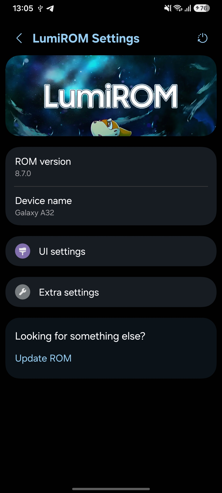
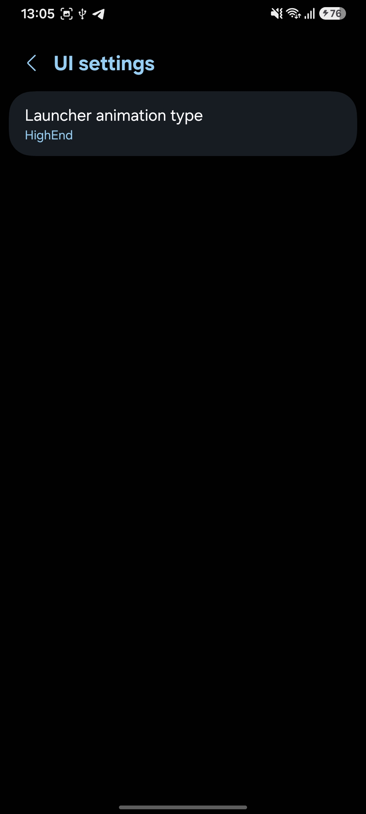
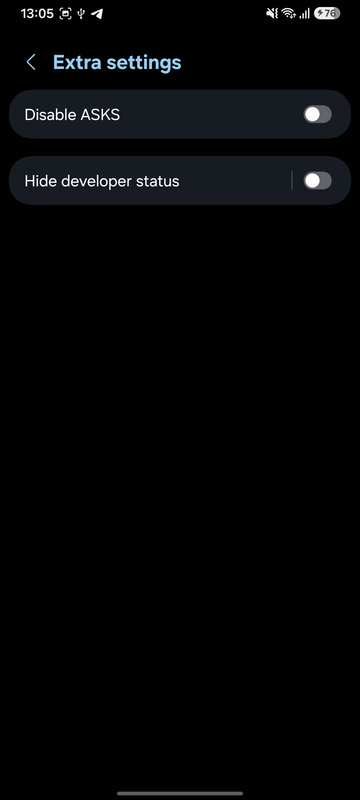

# What's changed on LumiROM 8.7.0?

> [!IMPORTANT]
> On the first boot after updating to 8.7.0, the device will show an **"Optimizing apps"** screen and then **reboot on its own**.
> **This reboot is intentional**.
> Once it finishes rebooting, everything works normally - no action is needed on your side.

## Features
- Added **LumiROM Settings**, a brand new settings section with the LumiROM logo, translated to 34 languages and with its own icon:
  - **UI settings**: choose the launcher animation type.
  - **Extra settings**: disable ASKS, hide developer status.
  - Reboot options menu (Normal, Recovery, Download).
  - Integrated into Settings search, and a shortcut to Cloudy via **Update ROM**.
- Added **KnoxPatch** integration (built-in, no root): Samsung apps and features work again after unlocking bootloader:
  - Samsung Health and Samsung Health Monitor.
  - SmartThings, Find My Mobile and Samsung Cloud.
  - Secure Folder and Private Share.
  - Auto Blocker and Secure Wi-Fi.
- Enabled the **signature verification bypass**, so apps signed with an old signature scheme can be installed.

## Fixes
- Fixed the media picker crash loop caused by missing `res/*.mime.types` resources in the rebuilt `framework.jar`.
- Fixed apps that require knox patching, things like work profile should now work.
- Fixed notification round style, now if you apply an effect, it will correctly render on the phone.
- Fixed Samsung Camera, now 0.5x displays properly and fully works.
- [a32] Fixed portrait mode that generated a green picture instead of the normal photo.

## More
- [Repo] New `LumiSettings` mod with its own build pipeline: `framework.jar` and `SecSettingsIntelligence` are now decompiled, patched and rebuilt.
- [Repo] New `KnoxPatch` mod: static hooks in `framework.jar`, `knoxsdk.jar` and `samsungkeystoreutils.jar`.
- [Repo] `DISABLE_SIGNATURE_VERIFICATION` now patches `framework.jar`, and the dead `PATCH_PRIVATE_SHARE` was removed.
- [Repo] Added a WSM debloat step so samsung watches won't be forgotten after a reboot.

# Screenshots

  

# Download
[Download LumiROM 8.7.0](https://t.me/LumiROMs)
